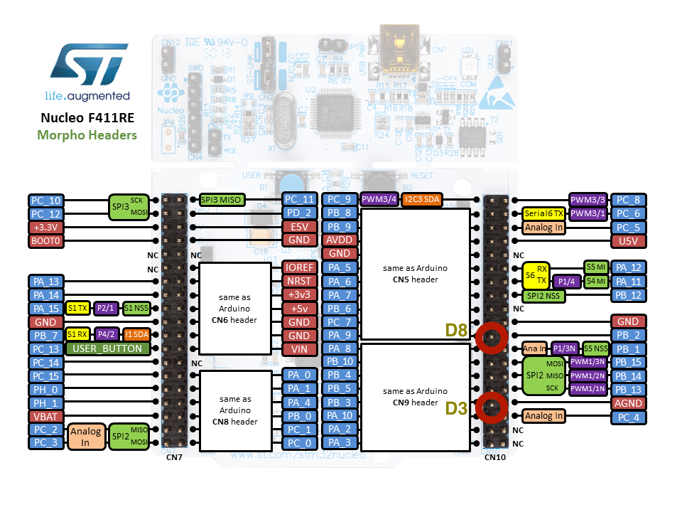
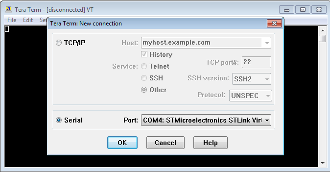

# mbed Connect 2016 - Building an internet connected lighting system - Instructions

Welcome to our session at mbed Connect 2016! If you have any questions, please just give a shout. We are here to help.

欢迎来到mbed Connect 2016， 在这节的讲解中，如果您有任何疑问，请随时提问，这节活动的宗旨就是解答您的任何问题，帮助您更快上手mbed。

In this session we'll be building four examples together, introducing you to:

今天，我们将把四个应用放在一起，做一个端到端的案例。

1. Connecting devices to mbed Device Connector. 把终端设备连接到mbed Device Connector
1. Interacting with devices through the mbed Device Connector API. 通过mbed Device Connector 的API 来与终端设备交互
1. Building a web app to control devices. 做一个网页应用来控制终端设备

We will demonstrate everything on stage, but in case you're stuck this document will help you get back on track. We've also listed some additional exercises if you want a challenge.

我们将会在台上展示所有的过程，但是如果你觉得这个文档有任何不清晰的地方，请及时提出，我们可以帮助您解决疑问。如果您希望在今天试一下开发更复杂的应用，在文档的最后，我们也列出了一些附加题。

> If you happen to be much faster than everyone else, help your neighbours. 如果您能很快得完成每一个步骤，希望您能帮助您身边的人。

## Prerequisites 先决条件

We need to install a few pieces of software that we'll be using.
On your computer, 我们先要安装几个软件：

1. Install a recent version of [node.js](https://nodejs.org) (4.x or higher). Node.js 版本4.0及以上
1. Download the source code for this workshop from [here](https://github.com/ARMmbed/workshop-mbed-connect-connected-lighting) - and unpack in a convenient location. 下载今天我们要做的应用的源代码 并解压。 [here](https://github.com/ARMmbed/workshop-mbed-connect-connected-lighting)

If you are on Windows, also install, 如果你用的是windows, 安装：

1. [ST Link](http://janjongboom.com/downloads/st-link.zip) - serial driver for the board.  ST Link： ST的串口驱动
    * Run `dpinst_amd64` on 64-bits Windows, `dpinst_x86` on 32-bits Windows.
    * Afterwards, unplug your board and plug it back in. 拔出再插入开发板
    * (Not sure if it configured correctly? Look in 'Device Manager > Ports (COM & LPT)', should list as STLink Virtual COM Port. 在设备管理器里面，端口（COM & LPT）部分，你可以找到STLink Virtual COM Port。这就是你设备的端口。
1. [Tera term](https://osdn.net/projects/ttssh2/downloads/66361/teraterm-4.92.exe/) - to see debug messages from the board. 用来查看串口

## Setup 设置

1. Attach the Grove base shield to your development board. 把Grove base shield插到开发版上。
1. Attach the following components to the Grove shield， 把下列元件插到base shield上：
    * WiFi module to Grove `D2`. wifi无线网络模块，插到D2
    * Put a jumper wire from *Pin* `D3` to `D8`.
     把D3 和 D8 连接起来
    * LED to Grove `D6` (to INPUT port on LED). 把LED插到D2接口
    * Accelerometer to any Grove `I2C` port. 加速计插入任意一个I2C的接口
1. Connect the NUCLEO F411RE board to your computer. 把开发版插入电脑的usb口
1. The board mounts as a mass-storage device (like a USB drive). Verify that you can see it (the drive name will be NUCLEO). 电脑上会显示一个U盘设备叫NUCLEO
1. Double-click on `mbed.htm` - you'll be redirected to the [F411RE platform page](https://developer.mbed.org/platforms/ST-Nucleo-F411RE/). U盘里面有一个文件叫mbed.htm，双击打开，你将会进入[F411RE platform page](https://developer.mbed.org/platforms/ST-Nucleo-F411RE/)页面。
    * If prompted to sign in, sign in or create an account. 如果要登入，请注册一个账号并登入。
1. Click the **Add to your mbed Compiler** button. 点击**Add to your mbed Compiler**，在页面的右边， 可能需要向下滚动一下。
1. Click the **Compiler** button. 点击页面右上的**Compiler**按钮
1. An IDE should open. Congratulations! 一个在线开发环境会打开。

**Local development:** If you like things locally, you can do so by using [mbed CLI](https://docs.mbed.com/docs/mbed-os-handbook/en/5.1/getting_started/blinky_cli/#installing-mbed-cli-and-a-toolchain). I very much recommend to just use the online IDE, as it makes it easier for us, but if you want to continue hacking in the future, this is a nice way.

线下开发：如果你想试下离线开发的工具，请安装[mbed CLI](https://docs.mbed.com/docs/mbed-os-handbook/en/5.1/getting_started/blinky_cli/#installing-mbed-cli-and-a-toolchain)。线上线下的源代码都是一样的。

## 1. Light that responds to motion 移动触发的LED灯

We'll run a program that will turn the LED on whenever motion is detected.
现在我们做一个由振动触发的LED灯。

1. Make sure that you have the online compiler open. 打开线上开发环境
1. Click the Import button, then click **Click Here to import from URL**. 按“import” 按钮来载入源代码。
1. Paste the following URL: https://github.com/ARMmbed/workshop-mbed-connect-connected-lighting 在弹出的对话框里粘贴这个地址： https://github.com/ARMmbed/workshop-mbed-connect-connected-lighting
    * Do **NOT** tick the 'Update libraries' checkbox. 注意不要勾选 'Update libraries’ 的选项。
1. Click the **Import** button. 按**Import**来载入。
1. In the top right corner, verify that the right development board is selected (NUCLEO F411RE). 在右上角的开发版选择按钮中，选择NUCLEO F411RE。

Next, we will select which program we will build. This step needs to be repeated every time we progress to the next example.
下面，我们将选择程序来进行编译。下面的步骤我们会重复几次，以编译不同的模版程序。

1. In the tree, locate ‘select_project.h'. 在左边的文件列表中，选择‘select_project.h'
1. Change the number in this file to the project you want to build. In this case `1`. 把文件中的数字改成你想编译的程序的数字。这里我们先选择1。

Now we can implement the code to make the light respond to movement. Open ``1_movement/main.h`` and under 'YOUR CODE HERE' add the following code:
下面我们把这个程序模版填充完整。

```cpp
void onPirTimeout() {
  rgbLed.setColorRGB(0, 0x0, 0x0, 0x0);
}

void pir_rise() {
  // Set the color to green
  rgbLed.setColorRGB(0, 0x00, 0xff, 0x00);

  // Turn the lights off again after X seconds
  pirTimeout.attach(&onPirTimeout, 5);
}
```

1. Now press Compile. 按“Compile”来进行编译
1. A file downloads. 编译好的文件会自动开始下载
1. Drag the file to the 'NUCLEO' disk. 把下载好的文件拖到 NUCLEO 的U盘里。
1. The LED should turn red. 开发板上的LED灯会变红。
1. Whenever movement is detected the LED turns green for 5 seconds. 有震动时，LED灯会变绿。

**Optional:** We have access to the built-in button (create an interrupt for `BLE_BUTTON_PIN_NAME`). Make it so that when you press the button the LED will go on indefinitely, ignoring the PIR sensor. Press again to listen to the PIR sensor again. This way we can simulate a normal light switch.

附加题：用开发板上的按钮，控制LED的开关。按一下，LED常亮，再按一下，LED灯回到由传感器触发。提示：给 BLE_BUTTON_PIN_NAME 写一个 interrupt 函数。

## 2. Connecting to mbed Device Connector 连接到 mbed Device Connector

We can now bring this program into mbed Device Connector.
我们现在可以将我们的开发板连接到mbed Device Connector上了。

First we need to obtain a security certificate:
首先，我们要下载一个安全证书：

1. Go to [connector.mbed.com](https://connector.mbed.com) and sign in with your mbed credentials. 前往[connector.mbed.com](https://connector.mbed.com)， 用你mbed的账户登陆。
1. Click on 'Security credentials'. 在左边的菜单里选择'Security credentials'.
1. Click on **Get my device security credentials**. 点击**Get my device security credentials**.
1. Copy the content of the gray box. 复制灰色部分的内容。
1. Create a new file ``security.h`` in the root folder of the project in the online compiler, and paste. 回到mbed在线开发环境的页面，在项目的根目录下创建一个叫做``security.h``的新文件，并把刚才复制的内容粘贴进去。

Now change the project and write some code，下面我们要修改这个程序：

1. In the tree, locate 'select_project.h' and change the number in this file to `2`. 在左边的文件浏览器里，找到 ‘select_project.h’， 把这个文件里面的数字改成 2
1. This program is a bit bigger than the previous one, it does the following: 这个程序比上一个更加复杂一些：
    * Has a variable (`ledStatus`) to listen to PIR (`NONE`), be permanently on (`ON`) or permanently off (`OFF`).
    * 有一些变量 (`ledStatus`) 来监听红外线传感器的值：常亮(`ON`) 或者常灭(`OFF`).
    * Has a variable (`ledColor`) for the color. (`ledColor`) 来控制颜色
    * Has a variable (`ledTimeout`) for the timeout after a PIR signal. (`ledTimeout`)来控制红外传感器的超时
    * Plus a variable (`pirCount`) to count how often the PIR sensor was triggered. (`pirCount`)来记红外传感器被触发的次数。
1. There is also code to connect to mbed Device Connector (see `main` function). 其他还有一些代码是用来连接到·mbed Device Connector· 的。详见 main 函数。
1. You can run this program fine without an internet connection, but we can turn the variables into 'cloud variables' managed by Device Connector. 这个程序可以离线执行，但是如果你给板子连上网线，你的本地变量就会自动被复制到云端，变成云变量。

Under `YOUR CODE HERE` paste， 在程序里面找到`YOUR CODE HERE`， 并把下面的代码粘贴进去：

```cpp
// We encode color in 3 bytes [R, G, B] and put it in an Int (default color: green)
SimpleResourceInt ledColor = client.define_resource("led/0/color", 0x00ff00, &colorChanged);
SimpleResourceInt ledTimeout = client.define_resource("led/0/timeout", 5);
SimpleResourceInt ledStatus = client.define_resource("led/0/permanent_status", STATUS_NONE, &statusChanged);
SimpleResourceInt pirCount = client.define_resource("pir/0/count", 0, M2MBase::GET_ALLOWED);
```

1. Compile and run this program. 现在，跟之前一样，编译， 并把编译好的文件复制粘贴到板子上。
1. When connection to the internet succeeded the built-in LED will burn. 板子在连上网之后，LED灯会打开。
1. LED should still go on when moving in front of the sensor. LED在探测到移动的时候也会继续闪烁

Your device should now show as registered on: [Connected devices in mbed Device Connector](https://connector.mbed.com/#endpoints) (type: light-system).
你的板子现在应该已经在云端出现了[Connected devices in mbed Device Connector](https://connector.mbed.com/#endpoints)。

### Showing debug messages 打开调试信息

To show debug messages we need a serial monitor. Follow the instructions below. Your output should be similar to: 如果你要调试程序，你需要打开串口。下面我们将教你怎么调试，你应该可以在串口上面看到如下的信息：

```
Hello world
[EasyConnect] Using Ethernet
[EasyConnect] Connected to Network successfully
[EasyConnect] IP address 192.168.1.16
[SMC] Device name 2bffcc03-05a6-4921-b345-ebddb52f6f71
[SMC] Registered object successfully!
```

#### Windows

To see debug messages, install, 如需要调试，请安装以下的软件：

1. [ST Link](http://janjongboom.com/downloads/st-link.zip) - serial driver for the board.
    * See above for more instructions. ST的串口驱动器
1. [Tera term](https://osdn.net/projects/ttssh2/downloads/66361/teraterm-4.92.exe/) - to see debug messages from the board. 串口监听器。

When you open Tera Term, select *Serial*, and then select the STLink COM Port. 
打开Tera Term，选择“串口”，然后选择 STLink COM 口。


#### OS/X

无需安装驱动，打开终端，直接执行以下命令
No need to install a driver. Open a terminal and run:

```
screen /dev/tty.usbm            # now press TAB to autocomplete and then ENTER
```

如果要退出，`CTRL+A` 然后 `CTRL+\` 然后 `y`.
To exit, press: `CTRL+A` then `CTRL+\` then press `y`.

#### Linux

If it's not installed, install GNU screen (`sudo apt-get install screen`). Then open a terminal and find out the handler for your device:

如果你没有screen这个程序，安装screen (`sudo apt-get install screen`），打开终端，并找到你的开发板的路径，如下：

```
$ ls /dev/ttyACM*
/dev/ttyACM0
```

Then connect to the board using screen:

然后通过screen来连接到板子的串口：

```
sudo screen /dev/ttyACM0 9600                # might not need sudo if set up lsusb rules properly
```

To exit, press `CTRL+A` then type `:quit`.
如要推出，按`CTRL+A` 然后键入 `:quit`.

## 3. Interacting with the light 人灯互动

We can now control the device from the mbed Device Connector API Console. In the previous section we created four cloud variables:

我们现在可以从mbed Device Connector API Console 来控制我们的LED。在前一章我们建立了四个云变量。

* `led/0/permanent_status` - Status of the LED. 0 = Listen to PIR, 1 = On, 2 = Off.
* `led/0/timeout` - Time after which the LED should turn off after being triggered by PIR sensor.
* `led/0/color` - Color of the LED (expressed as integer).
* `pir/0/count` - Number of times PIR sensor was triggered. When this number updates we know there was movement...

We can interact with these variables through the [API Console](https://connector.mbed.com/#console). 我们可以通过API Console](https://connector.mbed.com/#console) 来读写这几个变量。

1. In the API Console select 'Endpoint directory lookup'. 在API Console里，选择'Endpoint directory lookup’。
1. Select 'GET /endpoints/{endpoint-name}/{resource-path}’. 选择'GET /endpoints/{endpoint-name}/{resource-path}’.
1. Under 'endpoint' select your device. 在’endpoint’部分，选择你的板子。
1. Under 'resource-path' select '/pir/0/count'. 在’resource-path'部分，选择 '/pir/0/count'.
1. Click **TEST API**. 点击**TEST API**
1. Move your hand in front of the PIR sensor. 在红外传感器的前面挥挥手
1. Click **TEST API** again。再次点击**TEST API**
1. Verify that the number changed.  这时屏幕上的数字应该变了。

We can also write new values to the device.
我们也可以把数据写到板子上。

1. Select the 'PUT' tab. 选择’PUT'选项卡
1. Under 'resource-path' select ‘/led/0/permanent_status'. 在’resource-path’部分，选择‘/led/0/permanent_status'。
1. Under the *PUT Data tab* put '1'.在*PUT Data tab*中，键入’1'。
1. Click **TEST API**. 点击 **TEST API**
1. Verify that the LED is now on.确认LED是亮的。
1. Change back to ‘Parameters'. 回到'Parameters'
1. Under 'resource-path' select ‘/led/0/color'. 在 ‘resource-path'选项下，选择‘/led/0/color'.
1. Under 'PUT Data' put '16711935' (0xff00ff => 16711935 => pink). 在'PUT Data’里，键入’16711935’。
1. Click **TEST API**. 按**TEST API**
1. Verify that the light is pink.这时LED灯就会变成粉红色。
1. Change 'permanent_status' back to '0' (PIR). 把'permanent_status'变回 '0'

## 4. From code 通过代码与设备互动

We can also write some code to interact with this device.
我们同时也可以通过代码与设备互动。

1. Install a recent version of [node.js](https://nodejs.org) (4.x or higher). 安装一个较新版本的 [node.js](https://nodejs.org) 4.0以上。
1. Download the source code for this workshop from [here](https://github.com/ARMmbed/workshop-mbed-connect-connected-lighting/archive/master.zip) - and unpack in a convenient location. 把本例的源代码下载下来，并解压。
1. Open a terminal or a command window. 打开一个终端或者命令行。
1. Change directory to the folder where you download the `workshop-mbed-connect-connected-lighting` repository. 进入你下载解压的那个文件夹`workshop-mbed-connect-connected-lighting`。
1. Run `cd 4_from_code`. 在命令行执行`cd 4_from_code`
1. Run `npm install`.执行`npm install`
1. Open `main.js` in a text editor. 在编辑器里面打开`main.js`。

Now we need an access key (API key).

接下来我们需要一个接入端口的密钥 (API key)。

1. Go to the [Access Keys](https://connector.mbed.com/#accesskeys) page. 进入[Access Keys](https://connector.mbed.com/#accesskeys)页面。
2. Click **Generate new key**点击**Generate new key**以生成新的密钥。
3. Copy the key, and paste it in `main.js` on the first line.复制密钥，粘贴到`main.js`的第一行中去。
4. Go back to the terminal.回到命令行。
5. Run `node main.js`.执行`node main.js`

Output should be something like: 你会看到以下的输出：

```
Found 1 lights [ { name: '2bffcc03-05a6-4921-b345-ebddb52f6f71',
    type: 'light-system',
    status: 'ACTIVE' } ]
```

Now we can subscribe to movement... Under 'YOUR CODE HERE' add:
现在我们可以订阅运动这个变量，每次变量改变我们都能得到消息。。。在'YOUR CODE HERE’这里，把下面的代码复制进去。

```js
    api.putResourceSubscription(endpoint, '/pir/0/count', function(err) {
      console.log('Set subscription for pir count', err);
    });
```

1. Restart the program (from the terminal, press CTRL+C and start again). 重启程序：从命令行，按CTRL+C退出，然后重新运行之前的命令。
1. Move your hand in front of the sensor. 把手在传感器前面挥一挥
1. Output should show in the terminal! 你将会在命令行里看到相应的输出。

We can also control the device... Under 'YOUR CODE HERE' add:
我们现在就可以控制我们的板子了，在'YOUR CODE HERE’的地方，把下面的代码复制进去：

```js
    api.putResourceValue(endpoint, '/led/0/permanent_status', 1, function(err) {
      if (err) return console.error('Failed to set status...', err);

      console.log('Set status to 1...');

      api.putResourceValue(endpoint, '/led/0/color', 0xffa500, function(err) {
        if (err) return console.error('Failed to set color...', err);

        console.log('Set color to orange!');
      });
    });
```

And run again.
并再次运行

## 5. An app 一个应用

We use a web app to control all our lights now...
我们现在将做一个简单的网页应用来控制我们的LED灯。

1. In your terminal navigate to the `5_an_app` folder. 在你的终端命令行里，进入`5_an_app`文件夹。
1. Run `npm install`. 运行 `npm install`
1. Open `main.js` and paste your access key in again. 打开 `main.js`，并把你刚才的接入端口的密钥 (API key)再次粘贴进去。
1. Run `node main.js`.运行`node main.js`
1. Output should be something like:输出应该如下：

```
connected to mbed Cloud, retrieving initial device model
got devices [ { name: '2bffcc03-05a6-4921-b345-ebddb52f6f71',
    type: 'light-system',
    status: 'ACTIVE',
    endpoint: '2bffcc03-05a6-4921-b345-ebddb52f6f71' } ]
subscribed to 2bffcc03-05a6-4921-b345-ebddb52f6f71 /pir/0/count
got value 2bffcc03-05a6-4921-b345-ebddb52f6f71 status /led/0/permanent_status = 1
got value 2bffcc03-05a6-4921-b345-ebddb52f6f71 timeout /led/0/timeout = 5
got value 2bffcc03-05a6-4921-b345-ebddb52f6f71 color /led/0/color = 16753920
en0 192.168.1.11
Web server listening on port 5265!
```

1. Go to http://localhost:5265 and you can now interact with your devices. 打开浏览器，前往http://localhost:5265。现在你就可以和自己的板子互动了。
    * Color picker does not work in Safari... Try Firefox or Chrome. 取色器在SAFARI里不能使用，请用火狐浏览器，或者Chrome浏览器。
We can also show notifications whenever movement happens... Open `5_an_app/views/index.html` and add under 'YOUR CODE HERE':
我们也能让connector每次传感器被触发的时候，给你发一条消息。打开`5_an_app/views/index.html`然后在 'YOUR CODE HERE’ 部分，把下面的的代码粘贴进去。

```js
    // Movement detected! This is an event sent by the server...
    socket.on('change-count', function(endpoint, count) {
      // At the bottom of the page show a notification :-)
      showNotification('Movement detected at ' + endpoint);
    });
```

*(refresh the page for this to take effect)*
刷新网页

### On your mobile phone 在手机上

You can also see the page on your mobile phone.
你也可以在手机上看到你刚做的网页：

1. Look in the node.js output when you started 5_an_app (in the terminal). 在我们刚刚运行5_an_app的时候，在终端里面有一些输出。
1. Find a line similar to `en0 192.168.1.11`, that's your IP address. 找到类似于`en0 192.168.1.11`那一行，那就是你的IP地址。
1. Connect your phone to the same WiFi network as your **laptop** (not the same network as your device). 把你的手机连接到和电脑同一个无线网络。
1. On your phone go to http://YOUR_IP:5265 (like http://192.168.1.11:5625). 在你的手机上，前往http://你的IP:5265 (例如 http://192.168.1.11:5625).
1. See the same control app. 你将会看到和电脑上同样的一个控制灯的应用。
1. If you change something on the phone it also changes on your laptop! 如果你在手机应用上改变设置，电脑应用上也会实时更新。
1. On Chrome for Mobile? Click 'Add to homescreen' and it will look just like a real app =). 如果你在手机上用的是Chrome，点击“添加到桌面”就可以把这个网页应用和本地应用一样运行。
